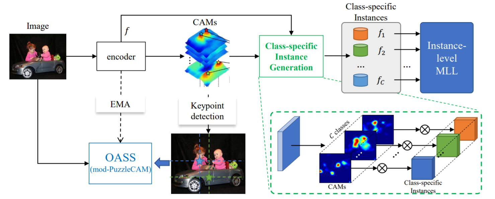
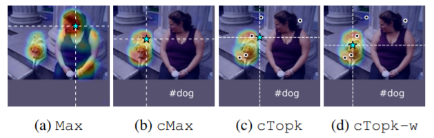

# Object-Aware-Self-Supervised-Multi-Label-Learning
The official implementation of our ICIP22' paper "Object-Aware-Self-Supervised-Multi-Label-Learning".

## Citation
- Please cite our paper if the code is helpful to your research. [arxiv](https://doi.org/10.48550/arXiv.2205.07028)
```
@misc{https://doi.org/10.48550/arxiv.2205.07028,
  doi = {10.48550/ARXIV.2205.07028},
  url = {https://arxiv.org/abs/2205.07028},
  author = {Kaixin, Xu and Liyang, Liu and Ziyuan, Zhao and Zeng, Zeng and Veeravalli, Bharadwaj},
  keywords = {Computer Vision and Pattern Recognition (cs.CV), FOS: Computer and information sciences, FOS: Computer and information sciences},
  title = {Object-Aware Self-supervised Multi-Label Learning},
  publisher = {arXiv},
  year = {2022},
  copyright = {arXiv.org perpetual, non-exclusive license}
}
```

## Abstract
Multi-label Learning on Image data has been widely exploited with deep learning models. However, supervised training on deep CNN models often cannot discover sufficient discriminative features for classification. As a result, numerous self-supervision methods are proposed to learn more robust image representations. However, most self-supervised approaches focus on single-instance single-label data and fall short on more complex images with multiple objects. Therefore, we propose an Object-Aware Self Supervision (OASS) method to obtain more fine-grained representations for multi-label learning, dynamically generating auxiliary tasks based on object locations. Secondly, the robust representation learned by OASS can be leveraged to efficiently generate Class-Specific Instances (CSI) in a proposal-free fashion to better guide multi-label supervision signal transfer to instances. Extensive experiments on the VOC2012 dataset for multi-label classification demonstrate the effectiveness of the proposed method against the state-of-the-art counterparts.

## Overview


<br>

# Prerequisite
- Python 3.8, PyTorch 1.7.0, and more in requirements.txt
- CUDA 10.1, cuDNN 7.6.5
- 4 x Titan RTX GPUs

# Usage
## Instruction
We have 4 key point detecting strategies: ```Max```, ```Channel-wise Max (cMax)```, ```Channel-wise Top-k (cTopk)``` and ```Channel-wise weighted Top-k (cTopk-w)```. Besides, we extract patch-level features using the Exponential Moving Average (EMA), so that the patch-level features generated by a self-ensembled teacher is more stable and accurate.



## Install python dependencies
```bash
python3 -m pip install -r requirements.txt
```

## Download PASCAL VOC 2012 devkit
Follow instructions in http://host.robots.ox.ac.uk/pascal/VOC/voc2012/#devkit

For test dataset, we use the dataset indicated in VOC2012 website instead of the test dataset in Puzzle-CAM.  ```(./data/test.txt)```

## 1. Train an image classifier with Max strategy
We perform self-supervision on the merged CAM.

```bash
python3 train_classification_with_puzzle_max.py --architecture resnet50 --alpha_schedule_re 0.05 --alpha_re 3.00 --alpha_p 0.5 --tag ResNet50_Max --data_dir $your_dir
```

## 2. Train an image classifier with cMax strategy
Instead of performing self-supervision on the merged CAM, we apply such a strategy to each channel of CAM.

```bash
python3 train_classification_with_puzzle_cMax_ema.py --architecture resnet50 --alpha_schedule_re 0.05 --alpha_re 3.00 --alpha_p 0.5 --tag ResNet50_cMax --data_dir $your_dir
```


## 3. Train an image classifier with cTopk strategy
Similar to cMax, for each CAM channel, we select k local maxima on CAM
with the top CAM values and calculate the keypoint as theirgeometric center.

```bash
python3 train_classification_with_puzzle_cTopk_ema.py --architecture resnet50 --alpha_schedule_re 0.05 --alpha_re 3.00 --alpha_p 0.5 --tag ResNet50_cTopk --data_dir $your_dir
```

## 4. Train an image classifier with cTopk-w strategy
Similar to cTopk, we calculate the geometric center by weighted averaging,
where the weights are the corresponding normalized CAM responses.

```bash
python3 train_classification_with_puzzle_cTopk_w_ema.py --architecture resnet50 --alpha_schedule_re 0.05 --alpha_re 3.00 --alpha_p 0.5 --tag ResNet50_cTopk_w --data_dir $your_dir
```

## 5. Results

We conducted extensive experiments on VOC2012 benchmark dataset to demonstrate our advances in Multi-label Classification. The specific results, please refer to our paper.


## 6. Acknowledgements
This implementation is developed upon [PuzzleCAM](https://github.com/OFRIN/PuzzleCAM). 
We thanks its authors for effort and providing wonderful codebase!

For any issues, please check the issue column for any existing discussions before opening an issue.
Or you can contact [Xu_Kaixin@i2r.a-star.edu.sg](Xu_Kaixin@i2r.a-star.edu.sg).
